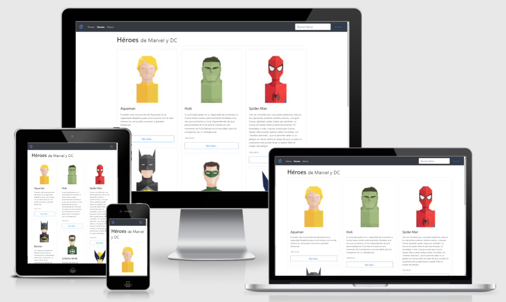

# Heroes SPA
SPA (Single page application) de heroes de Marvel y DC hecha en Angular. Puedes apreciar la web final dando [click acá](https://fjalcode-heroes-spa.web.app/)



> Previsualización usando [Am I Responsive?](http://ami.responsivedesign.is/)

## Herramientas

Para este proyecto se utilizarón las siguientes herramientas

* [Angular](https://angular.io/)
* [Node](https://nodejs.org/es/)
* [Bootstrap](https://getbootstrap.com/)
* [Animate.css](https://animate.style/)
* [Firebase](https://firebase.google.com/?hl=es)

## Development environment

```bash
git clone https://github.com/{user}/{ruta}
cd heroes-spa
npm install
ng serve -o
```
> Ejecuta `ng deploy` para ejecutar a nivel de producción un build y deploy en firebase


## Autor


[<br /><sub><b>Fernando Antúnez</b></sub>](https://github.com/FJALCode)<br />[💻](https://github.com/FJALCode "Code") [📢](#talk-Meabed "Talks")

## Expresiones de Gratitud
Proyecto basado en cursos de [Fernando Herrera](https://github.com/Klerith).